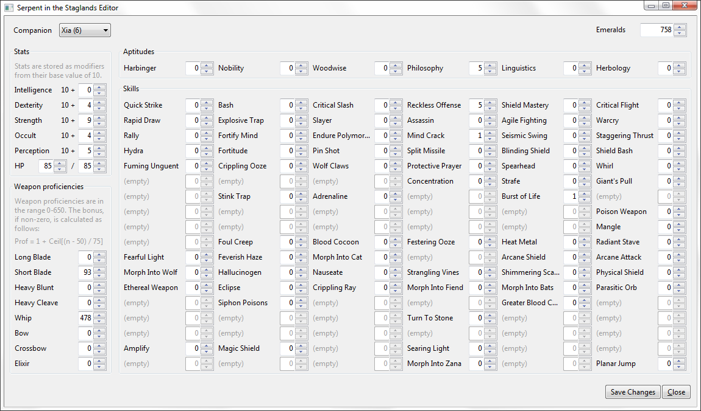

# Serpent in the Staglands Editor

Save game editor for [Serpent in the Staglands](http://serpentinthestaglands.com/).

# Features

- Party
  - [x] Emeralds
- Companions
  - [x] Stats
  - [x] Skills
  - [x] Spells
  - [x] Aptitudes
  - [ ] Unallocated points
  - [x] Weapon proficiencies
  - [ ] Name
  - [ ] Gender
  - [ ] Portrait
  - [ ] Race and racial attributes
  - [ ] HP
  - [ ] XP
  - [ ] Bound?
  - [ ] Companions not currently in party
- Versions
  - [x] V.13

# Usage

Backup of your save game files before editing. Save games are found in:
```
%USERPROFILE%\AppData\LocalLow\Whalenought Studios\Serpent in the Staglands
```

First, you are asked to select the save game location. Select the folder of the
actual save game you wish to edit (for example, `_Quick_Save`). You should then
see something similar to this. Some skill and spell slots are reserved, but are
not available in game; these will be disabled.



Before saving changes, a backup of each modified file is automatically created
and labeled with the current date and time, for example
`_Quick_Save\Party1.2015-07-20T19.14.03Z.txt`. You may be able to use this file
to recover corrupted state if something goes wrong.

# License

[MIT](LICENSE)
